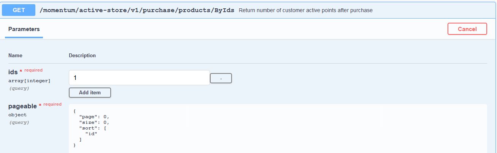
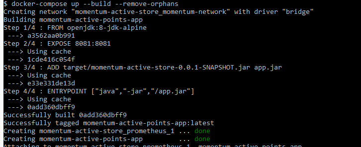

#Momentum Active Points Store
  
   * The application has exposed 3 endpoints:
     
                * GetMapping  - /momentum/active-store/v1/all/products
     
                    - This end point returns all the products in the database 
     
                * GetMapping - /momentum/active-store/v1/customer/{id} 
     
                    - This endpoind passes the customer thats making a purchase by using the unique id
                    - If the id passed by the user is not in the database the  404 exception Not found is thrown
                
                * GetMapping - /momentum/active-store/v1/purchase/products/ByIds
     
                    - This is takes list as the customer purchase multiple products thus giving the option pass a number of product ids
                    - if this endpoint is called before "/momentum/active-store/v1/customer/{id}" the user is requested to pass the customer id before purchasing
                    - This returns the remaining customer active points after a successful transaction based on customer id
                    _ Updates the active points for that specific customer that made the transaction after succesfull transaction 
                    

   * Technologies used during development
     
                * H2 database
                * Spring data jpa
                * Project lombok
                * Docker
                * OpenAPI\Swagger
                * Mockito
                * TestRestTemplate
                * Docker Compose
       
   * How to run\deploy the application
            
                 * In the root directory of the application I have created a docker-compose.yml file
                 
                 * command to execute docker-compose file
                        docker-compose up --build or docker up
                 * Stop the the running containers
                        docker-compose down - this will not stop the containers but it also remove them
   
   * Example curl requests per endpoint
     
         * GetMapping  - /momentum/active-store/v1/all/products 
     
              curl -X GET "http://localhost:8081/momentum/active-store/v1/all/products" -H  "accept: application/json"
         
         * GetMapping - /momentum/active-store/v1/customer/{id}
            
              curl -X GET "http://localhost:8081/momentum/active-store/v1/customer/1" -H  "accept: application/json"
          
         * GetMapping - /momentum/active-store/v1/purchase/products/ByIds
         
              curl -X GET "http://localhost:8081/momentum/active-store/v1/purchase/products/ByIds?ids=1&page=0&size=0&sort=id" -H  "accept: */*"
   
   * PostMan Requests
     
         * GetMapping  - /momentum/active-store/v1/all/products
                 
    
         *  GetMapping - /momentum/active-store/v1/customer/{id}
                 
    
         *   GetMapping - /momentum/active-store/v1/purchase/products/ByIds
                

   * Swagger-UI Requests
     
         *   GetMapping  - /momentum/active-store/v1/all/products
     
               
    
         *   GetMapping - /momentum/active-store/v1/customer/{id}
                 

         *   GetMapping - /momentum/active-store/v1/purchase/products/ByIds
            

   *  Swagger-UI  
        
        * After starting up the container swagger is found on the link below
       
           http://localhost:8081/momentum-active-store.html
          
   * Docker Compose starting the application
    
       
        The container is configured to be accessible in momentum-networ with port 8081
